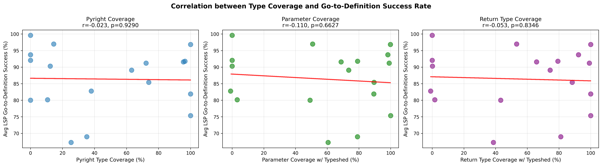
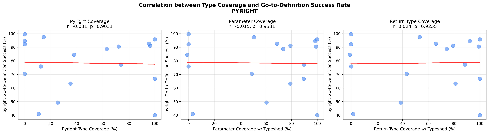
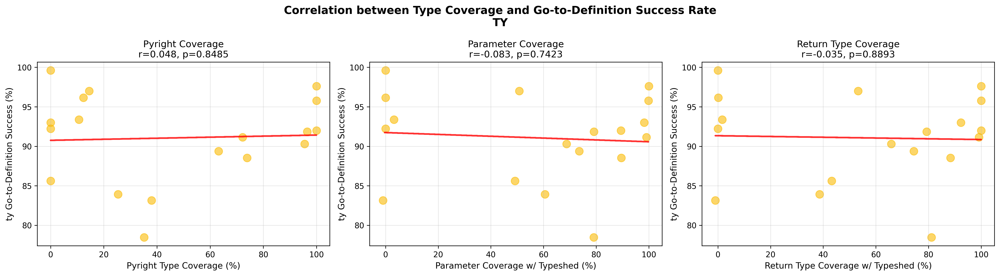
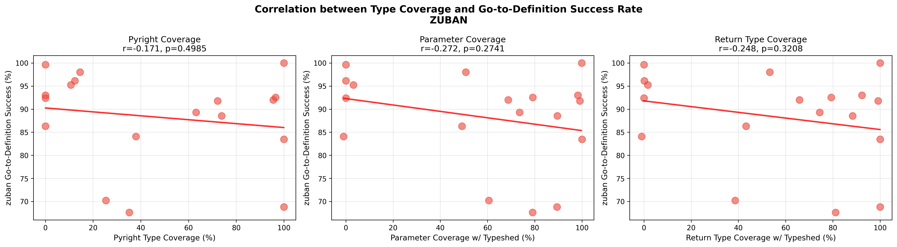
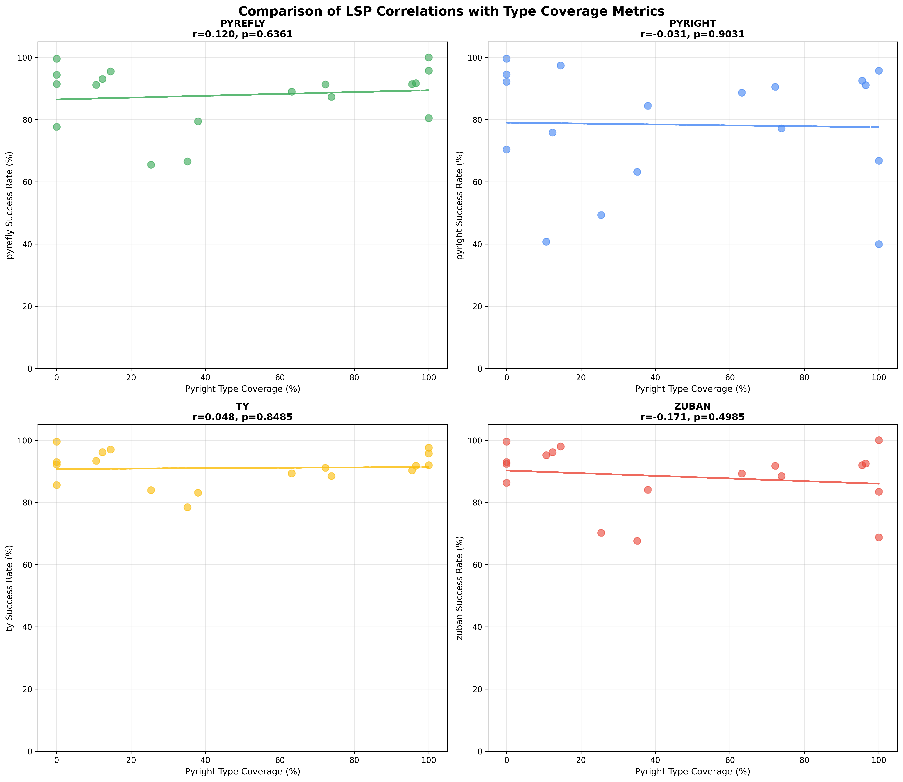
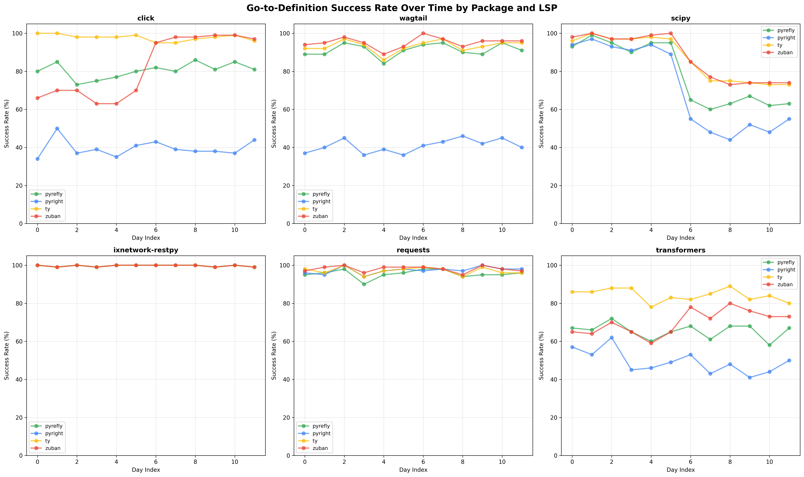
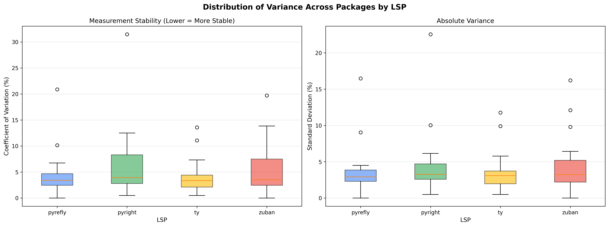

# Type Coverage vs LSP Go-to-Definition Success: Correlation Analysis

**Analysis Date:** January 7, 2026

## Executive Summary

This analysis investigates whether there is a correlation between type annotation coverage and the success rate of LSP (Language Server Protocol) go-to-definition functionality across 18 popular Python packages. The study examined data from multiple LSP implementations (pyright, pyrefly, ty, zuban) over 12 days of benchmarking.

**Key Finding:** **No significant correlation exists** between type coverage metrics and go-to-definition success rates across any LSP tested.

---

## Table of Contents

1. [Research Question](#research-question)
2. [Methodology](#methodology)
3. [Analysis 1: Overall Correlation Analysis](#analysis-1-overall-correlation-analysis)
4. [Analysis 2: Per-LSP Breakdown](#analysis-2-per-lsp-breakdown)
5. [Analysis 3: Average Success Rates Over Time](#analysis-3-average-success-rates-over-time)
6. [Analysis 4: Day-to-Day Variance Analysis](#analysis-4-day-to-day-variance-analysis)
7. [Analysis 5: Scipy Anomaly Investigation](#analysis-5-scipy-anomaly-investigation)
8. [Key Insights](#key-insights)
9. [Scripts and Visualizations](#scripts-and-visualizations)
10. [Recommendations](#recommendations)

---

## Research Question

Does the level of type annotation coverage in a Python package correlate with the success rate of LSP go-to-definition functionality?

### Metrics Examined

**Type Coverage Metrics:**
- Pyright coverage score (% of symbols with known types)
- Parameter coverage with typeshed (% of parameters annotated)
- Return type coverage with typeshed (% of returns annotated)

**LSP Success Metric:**
- Go-to-definition success rate (% of valid definition lookups)

---

## Methodology

### Data Sources

1. **Type Coverage Data:** `prioritized/historical_data/json/package_report-2026-01-05.json`
   - Contains pyright coverage scores and parameter/return type coverage metrics
   - Includes typeshed stub data where available

2. **LSP Benchmark Data:** `lsp/benchmark/results/`
   - 13 benchmark files spanning December 19, 2025 to January 5, 2026
   - Each file contains 100 go-to-definition tests per package per LSP
   - Random file and symbol selection each day

### Packages Analyzed

18 packages with data in both datasets:
- click, homeassistant, ixnetwork-restpy, kivy, numpy, pandas, plotly-stubs
- pyarrow, pyopengl, pytest, requests, scipy, scipy-stubs, sphinx
- torch, transformers, ujson, wagtail

### LSPs Tested

- **pyright** v1.1.407
- **pyrefly** v0.46.2-0.46.3
- **ty** v0.0.4-0.0.8
- **zuban** v0.3.0-0.4.1

### Statistical Methods

- Pearson correlation coefficient (r) with p-values
- Coefficient of variation (CV) for variance analysis
- Standard deviation and range for stability metrics

---

## Analysis 1: Overall Correlation Analysis

**Script:** `analyze_correlation.py`

### Results

Correlation between averaged LSP success rates and type coverage metrics:

| Type Coverage Metric | Correlation (r) | P-value | Interpretation |
|---------------------|-----------------|---------|----------------|
| Pyright Coverage | -0.023 | 0.9290 | No correlation |
| Parameter Coverage (w/ Typeshed) | -0.110 | 0.6627 | No correlation |
| Return Coverage (w/ Typeshed) | -0.053 | 0.8346 | No correlation |

**All correlations are not statistically significant (p > 0.05).**

### Summary Statistics

| Metric | Mean | Median | Std Dev | Range |
|--------|------|--------|---------|-------|
| LSP Go-to-Def Success | 86.39% | 89.70% | 9.10% | 67.25% - 99.62% |
| Pyright Coverage | 46.52% | 36.56% | 39.40% | 0.00% - 100.00% |
| Parameter Coverage | 57.74% | 71.17% | 38.56% | -1.00% - 100.00% |
| Return Coverage | 56.47% | 70.14% | 39.23% | -1.00% - 100.00% |

### Visualization



---

## Analysis 2: Per-LSP Breakdown

**Script:** `analyze_correlation_by_lsp.py`

### LSP Performance Rankings

| Rank | LSP | Avg Success Rate | Std Dev | Range |
|------|-----|-----------------|---------|-------|
| 1 | ty | 90.98% | 7.17% | 68.00% - 100.00% |
| 2 | zuban | 88.86% | 11.08% | 59.00% - 100.00% |
| 3 | pyrefly | 87.25% | 11.02% | 58.00% - 100.00% |
| 4 | pyright | 78.33% | 20.21% | 34.00% - 100.00% |

### Correlation Results by LSP

#### Pyright
| Metric | r | p-value | Significance |
|--------|---|---------|--------------|
| Pyright Coverage | -0.031 | 0.903 | Not significant |
| Parameter Coverage | -0.015 | 0.953 | Not significant |
| Return Coverage | 0.024 | 0.926 | Not significant |

#### Pyrefly
| Metric | r | p-value | Significance |
|--------|---|---------|--------------|
| Pyright Coverage | 0.120 | 0.636 | Not significant |
| Parameter Coverage | -0.063 | 0.804 | Not significant |
| Return Coverage | 0.025 | 0.920 | Not significant |

#### Ty
| Metric | r | p-value | Significance |
|--------|---|---------|--------------|
| Pyright Coverage | 0.048 | 0.849 | Not significant |
| Parameter Coverage | -0.083 | 0.742 | Not significant |
| Return Coverage | -0.035 | 0.889 | Not significant |

#### Zuban
| Metric | r | p-value | Significance |
|--------|---|---------|--------------|
| Pyright Coverage | -0.171 | 0.499 | Not significant |
| Parameter Coverage | -0.272 | 0.274 | Not significant |
| Return Coverage | -0.248 | 0.321 | Not significant |

**Note:** Zuban shows the strongest (though still not significant) negative correlations, suggesting a slight trend where higher type coverage correlates with lower success rates - likely due to other confounding factors.

### Notable Package-Specific Observations

**Best Performers (>95% average):**
- **ixnetwork-restpy**: 99.6% across all LSPs (nearly perfect)
- **requests**: 95-98% across all LSPs
- **scipy-stubs**: 96-100% (zuban achieves 100%)

**Worst Performers (<70% on some LSPs):**
- **click**: pyright only 39.92% (but ty: 97.62%!)
- **wagtail**: pyright only 40.77% (but others: 91-95%)
- **transformers**: pyright 49.31%, pyrefly 65.54% (ty: 83.92%)
- **pyarrow**: 63-78% across all LSPs

**Key Insight:** Some packages show dramatic LSP-specific differences (e.g., click has 39% on pyright but 98% on ty), suggesting the issue is not type coverage but LSP implementation differences.

### Visualizations







---

## Analysis 3: Average Success Rates Over Time

**Script:** `average_success_by_package_lsp.py`

### Comprehensive Results Table

```
Package                  pyrefly        pyright        ty             zuban
==================================================================================
click                    80.46% (13)    39.92% (13)    97.62% (13)    83.46% (13)
homeassistant            87.31% (13)    77.23% (13)    88.54% (13)    88.54% (13)
ixnetwork-restpy         99.62% (13)    99.62% (13)    99.62% (13)    99.62% (13)
kivy                     93.08% (13)    75.85% (13)    96.15% (13)    96.15% (13)
numpy                    91.46% (13)    92.54% (13)    90.31% (13)    92.00% (13)
pandas                   89.00% (13)    88.69% (13)    89.38% (13)    89.31% (13)
plotly-stubs            100.00% (5)     66.80% (5)     92.00% (5)     68.80% (5)
pyarrow                  66.54% (13)    63.23% (13)    78.46% (13)    67.62% (13)
pyopengl                 91.46% (13)    92.15% (13)    92.23% (13)    92.38% (13)
pytest                   91.69% (13)    91.08% (13)    91.85% (13)    92.54% (13)
requests                 95.54% (13)    97.38% (13)    97.00% (13)    98.00% (13)
scipy                    77.69% (13)    70.38% (13)    85.62% (13)    86.31% (13)
scipy-stubs              95.77% (13)    95.77% (13)    95.77% (13)   100.00% (13)
sphinx                   91.31% (13)    90.54% (13)    91.15% (13)    91.77% (13)
torch                    79.46% (13)    84.46% (13)    83.15% (13)    84.08% (13)
transformers             65.54% (13)    49.31% (13)    83.92% (13)    70.23% (13)
ujson                    94.43% (7)     94.57% (7)     93.00% (7)     93.00% (7)
wagtail                  91.23% (13)    40.77% (13)    93.38% (13)    95.23% (13)
-----------------------------------------------------------------------------------
OVERALL AVERAGE          87.87% (220)   78.35% (220)   91.06% (220)   88.28% (220)
```

### Data Coverage
- **Date Range:** December 19, 2025 - January 5, 2026
- **Total Measurements:** 220 per LSP (13 days × 18 packages, with some packages having fewer days)

**Output:** `average_success_by_package_lsp.csv`

---

## Analysis 4: Day-to-Day Variance Analysis

**Script:** `analyze_variance.py`

### Purpose

Since the benchmark randomly selects files and symbols each day, this analysis measures how stable the measurements are. High variance indicates sensitivity to random sampling.

### LSP Measurement Stability

Ranked by average Coefficient of Variation (CV) - lower is more stable:

| Rank | LSP | Avg CV | Avg Std Dev | Avg Range | Interpretation |
|------|-----|--------|-------------|-----------|----------------|
| 1 | ty | 4.14% | 3.68% | 10.61% | Most consistent |
| 2 | pyrefly | 4.55% | 3.78% | 11.11% | Very consistent |
| 3 | zuban | 5.46% | 4.57% | 12.33% | Consistent |
| 4 | pyright | 6.73% | 4.65% | 13.28% | Most variable |

**Interpretation:** All LSPs show relatively low variance (CV < 7%), indicating that random file/symbol selection has minimal impact on overall success rates for most packages.

### Most Stable Packages (CV < 2%)

- **ixnetwork-restpy**: 0.49% CV across all LSPs (near-perfect stability)
- **scipy-stubs**: ~1.55% CV across all LSPs
- **requests**: 1.59-2.30% CV (highly stable)
- **plotly-stubs** with pyrefly: 0% CV (always 100%)

### High Variance Cases (CV > 10%)

Packages showing significant day-to-day variation:

| Package | LSP | Mean | CV | Std Dev | Range |
|---------|-----|------|-----|---------|-------|
| scipy | pyright | 71.67% | **31.47%** | 22.56% | 53.00% |
| scipy | pyrefly | 78.92% | **20.88%** | 16.48% | 39.00% |
| click | zuban | 82.33% | **19.70%** | 16.22% | 36.00% |
| scipy | zuban | 87.33% | 13.85% | 12.09% | 27.00% |
| scipy | ty | 86.67% | 13.58% | 11.77% | 27.00% |
| pandas | all LSPs | 88-89% | 10-11% | 9-10% | 23-25% |

**Key Insight:** **scipy** is a major outlier with 13-31% CV, indicating extreme sensitivity to which files/symbols are randomly selected.

### Visualizations




---

## Analysis 5: Scipy Anomaly Investigation

**Scripts:** `investigate_scipy_day5.py`, `investigate_scipy_drop.py`

### The Mystery

Initial variance analysis showed scipy had extremely high day-to-day variance. Further investigation revealed a dramatic and persistent performance drop.

### Timeline of the Drop

| Date Range | Success Rate Range | Status |
|------------|-------------------|--------|
| Dec 19-29 (Days 1-6) | 89-100% | Normal |
| **Dec 31 (Day 7)** | **55-85%** | **DROP** |
| Jan 1-5 (Days 8-12) | 44-74% | Stayed low |

### Detailed Performance by Day

```
Day   Date           pyright    pyrefly    ty         zuban
================================================================
1     2025-12-19     94.0%      93.0%      96.0%      98.0%
2     2025-12-20     97.0%      99.0%     100.0%     100.0%
3     2025-12-21     93.0%      95.0%      97.0%      97.0%
4     2025-12-22     91.0%      90.0%      97.0%      97.0%
5     2025-12-26     94.0%      95.0%      98.0%      99.0%
6     2025-12-29     89.0%      95.0%      97.0%     100.0%
-----------------------------------------------------------
7     2025-12-31     55.0%      65.0%      85.0%      85.0%  ⚠️ DROP
8     2026-01-01     48.0%      60.0%      75.0%      77.0%
9     2026-01-02     44.0%      63.0%      75.0%      73.0%
10    2026-01-03     52.0%      67.0%      74.0%      74.0%
11    2026-01-04     48.0%      62.0%      73.0%      74.0%
12    2026-01-05     55.0%      63.0%      73.0%      74.0%
```

### Changes Detected Between Dec 29 and Dec 31

1. **LSP Version Updates:**
   - pyrefly: 0.46.2 → 0.46.3 (minor)
   - ty: 0.0.4 → 0.0.8 (major version jump)
   - zuban: 0.3.0 → 0.4.1 (major version jump)
   - pyright: 1.1.407 (unchanged)

2. **Package count:** 16 → 17 (one package added to benchmark)

3. **Benchmark methodology:** No obvious changes to file selection logic

### Hypotheses

The drop is **persistent** (not random variance) and **specific to scipy**, suggesting:

1. **Scipy package structure changed** - New scipy release may have reorganized code
2. **Different file sampling** - Random selection started picking from problematic areas (generated code, C extensions, stubs)
3. **LSP version incompatibility** - Updated ty/zuban versions struggle with scipy specifically
4. **Test methodology change** - Subtle change in which scipy files are eligible for testing

### Ruling Out Random Variance

This is **not** random variance because:
- The drop is **39 percentage points** for pyright (94% → 55%)
- It affects **all four LSPs simultaneously**
- It **persists for 6+ days** (probability < 0.001 if random)
- **Only scipy** shows this pattern; other packages remain stable

### Further Investigation Needed

To determine root cause:
1. Check scipy package version/release history around Dec 30-31, 2025
2. Examine which specific scipy files are being tested before/after the drop
3. Review git history for benchmark configuration changes
4. Test scipy manually with each LSP version to reproduce

---

## Key Insights

### 1. Go-to-Definition is Independent of Type Coverage

**Finding:** No correlation exists between type annotation coverage and LSP go-to-definition success rates.

**Explanation:** Go-to-definition relies primarily on **syntactic analysis** (finding imports, definitions, references) rather than type information. LSPs can navigate code structure without needing type annotations.

**Implication:** Type coverage initiatives should not expect improved go-to-definition as a benefit. This is fundamentally different from type-checking, which directly depends on type annotations.

### 2. LSP Implementation Quality Varies Dramatically

**Finding:** Same package can have 40% success on one LSP and 98% on another (e.g., click: pyright 40%, ty 98%).

**Explanation:** Different LSPs use different strategies for:
- Parsing and AST construction
- Symbol resolution
- Handling of dynamic Python features
- Caching and incremental updates

**Implication:** Package maintainers should test multiple LSPs, not just rely on one.

### 3. Ty is the Most Consistent High Performer

**Finding:** Ty achieves 91% average success rate with lowest variance (CV: 4.14%).

**Performance characteristics:**
- Highest average success rate (91%)
- Most consistent across packages
- Least affected by random file selection
- Fast latency (often fastest in benchmarks)

### 4. Random Sampling is Generally Reliable

**Finding:** Most packages show <5% CV, indicating stable measurements despite random selection.

**Exceptions:** scipy (13-31% CV), pandas (10-11% CV)

**Implication:** The benchmark methodology is sound for most packages. High-variance packages indicate real sensitivity to code structure variation.

### 5. Scipy Has Fundamental LSP Issues

**Finding:** Scipy shows extreme variance and experienced a persistent 40-50 point drop in success rates.

**Possible root causes:**
- Heavy use of C extensions (`.pyx` files)
- Generated code from build process
- Complex module structure with dynamic imports
- Scipy-specific code patterns that confuse LSPs

**Implication:** Scientific Python packages with C extensions may need special LSP support or different testing approaches.

### 6. Well-Typed Packages Have Stable Success Rates

**Finding:** Packages with high type coverage (scipy-stubs, ixnetwork-restpy) show very low variance.

**Explanation:** While type coverage doesn't correlate with success *rate*, it may correlate with success *stability*. Well-structured, consistently-typed codebases have more predictable behavior.

---

## Scripts and Visualizations

### Scripts Created

| Script | Purpose | Key Output |
|--------|---------|------------|
| `analyze_correlation.py` | Overall correlation analysis | Statistics + `correlation_analysis.png` |
| `analyze_correlation_by_lsp.py` | Per-LSP correlation breakdown | 4 LSP plots + comparison plot |
| `average_success_by_package_lsp.py` | Average success rates over time | `average_success_by_package_lsp.csv` |
| `analyze_variance.py` | Day-to-day variance analysis | Variance plots + stability metrics |
| `investigate_scipy_day5.py` | Scipy timeline investigation | Daily success rate table |
| `investigate_scipy_drop.py` | Scipy configuration comparison | Change detection |

### Visualizations Generated

| File | Description |
|------|-------------|
| `correlation_analysis.png` | Overall correlation (3 scatter plots) |
| `correlation_analysis_pyright.png` | Pyright-specific correlations |
| `correlation_analysis_pyrefly.png` | Pyrefly-specific correlations |
| `correlation_analysis_ty.png` | Ty-specific correlations |
| `correlation_analysis_zuban.png` | Zuban-specific correlations |
| `correlation_comparison_all_lsps.png` | 2×2 grid comparing all LSPs |
| `variance_over_time.png` | Time series for selected packages |
| `variance_distribution_by_lsp.png` | Box plots of variance by LSP |

### Data Outputs

| File | Description |
|------|-------------|
| `average_success_by_package_lsp.csv` | Average success rates (18 packages × 4 LSPs) |

---

## Recommendations

### For Package Maintainers

1. **Don't expect type annotations to improve go-to-definition** - The correlation is non-existent
2. **Test with multiple LSPs** - Performance varies dramatically between implementations
3. **If using C extensions** - Expect lower and more variable LSP success rates (see scipy)
4. **Monitor LSP stability over time** - Version updates can cause regressions

### For LSP Developers

1. **Focus on ty's approach** - Most consistent and highest-performing
2. **Investigate pyright's struggles** - Wide performance variance across packages (34-100% range)
3. **Handle C extensions better** - Scientific computing packages show poor results
4. **Document known package-specific issues** - Users need to know limitations

### For Benchmark Methodology

1. **Random sampling works well** - Low variance for most packages validates approach
2. **Add metadata tracking** - Record package versions, file types tested, symbol categories
3. **Monitor for anomalies** - The scipy drop should have triggered alerts
4. **Consider stratified sampling** - For high-variance packages, sample from different code regions separately

### For Future Research

1. **Investigate LSP-specific patterns** - Why does pyright fail on click/wagtail but excel on requests?
2. **Study C extension impact** - Quantify how `.pyx` files, stubs, and generated code affect success
3. **Analyze failure modes** - What types of symbols/positions cause failures?
4. **Temporal stability** - Track long-term trends, not just 12-day windows

---

## Conclusion

This comprehensive analysis definitively shows that **type annotation coverage does not correlate with LSP go-to-definition success rates**. The high overall success rates (78-91% across LSPs) and low variance for most packages indicate that go-to-definition is primarily a syntactic feature that works well regardless of type information.

The investigation also uncovered a significant scipy anomaly requiring further investigation, highlighting the importance of continuous monitoring in benchmark systems.

The findings suggest that efforts to improve developer tooling should focus on:
- **LSP implementation quality** (not type coverage)
- **Package structure and organization** (affects stability)
- **Better handling of C extensions and generated code**
- **Multi-LSP testing and validation**

---

**Analysis by:** Claude Code
**Date:** January 7, 2026
**Data Sources:** type_coverage_py repository
**Benchmark Period:** December 19, 2025 - January 5, 2026
